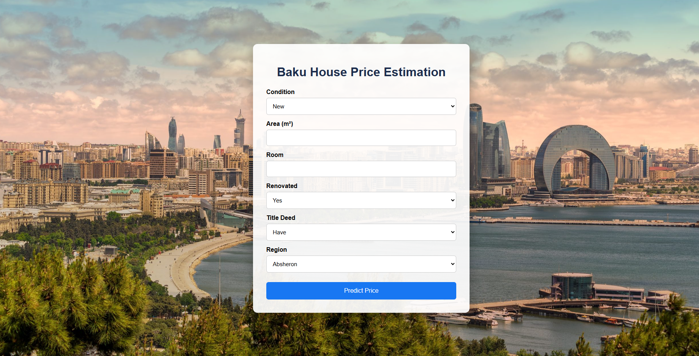
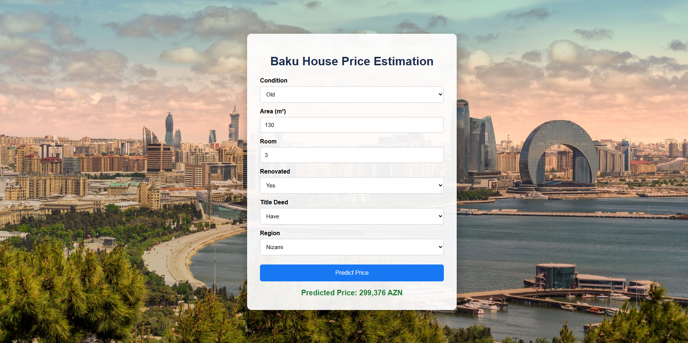

# Baku House Price Prediction Web App

## Overview

This project is a **machine learning web application** that predicts house prices in Baku based on several property features.
The system uses a **Random Forest regression model** trained on housing data and provides predictions through a **Flask-based web interface**.

Users can enter property information such as area, number of rooms, renovation status, ownership documents, and region, and the application will estimate the expected house price.

This project demonstrates an **end-to-end machine learning workflow**, including data preprocessing, model training, evaluation, and deployment.

---

## Features Used for Prediction

The model predicts house prices using the following features:

* **Area (m²)**
* **Number of rooms**
* **Repair status**
* **Title deed availability**
* **House category (new / old building)**
* **Region of the property**

Categorical features are encoded using **one-hot encoding** to ensure compatibility with the machine learning model.

---

## Machine Learning Model

The model used in this project is:

**Random Forest Regressor**

Random Forest was chosen because:

* It performs well with tabular datasets
* It captures nonlinear relationships between features
* It is robust to noise and feature scaling

---

## Technologies Used

* **Python**
* **Pandas** (data preprocessing)
* **Scikit-learn** (machine learning)
* **Flask** (web application framework)
* **HTML / CSS** (user interface)
* **Matplotlib & Seaborn** (data visualization)

---

## Project Structure

```
baku_house_price_prediction/
│
├── app.py
├── train_model.py
├── model.pkl
├── columns.pkl
├── processed_file_new.xlsx
├── requirements.txt
├── README.md
├── .gitignore
│
├── templates/
│   └── index.html
│
└── images/
    ├── form.png
    ├── input.png
    └── result.png
```

---

## How the System Works

### 1. Training Phase

The dataset is cleaned and preprocessed using Pandas.

Steps include:

* Handling missing values
* Converting categorical features into numeric form
* Removing unnecessary columns
* One-hot encoding region information

The processed data is then used to train a **Random Forest regression model**.

After training, the following files are saved:

```
model.pkl
columns.pkl
```

These files allow the application to load the trained model without retraining it every time.

---

### 2. Prediction Phase

When a user enters house details on the website:

1. The Flask application receives the input data
2. The input is converted into a DataFrame with the same structure used during training
3. The trained model generates a prediction
4. The predicted price is displayed on the webpage

---

## Model Evaluation

The model performance was evaluated using:

* **Mean Absolute Error (MAE)**
* **R² Score**

These metrics measure how close the predicted prices are to the actual market prices.

---

## Application Screenshots

### Input Form



### Example User Input


### Prediction Result



---

## Installation and Usage

### 1. Clone the repository

```
git clone https://github.com/yourusername/baku-house-price-prediction.git
cd baku-house-price-prediction
```

### 2. Install dependencies

```
pip install -r requirements.txt
```

### 3. Train the model (optional)

```
python train_model.py
```

This will generate:

```
model.pkl
columns.pkl
```

### 4. Run the Flask web application

```
python app.py
```

### 5. Open the application in your browser

```
http://127.0.0.1:5000
```

Enter house details and the system will return the predicted price.

---

## Future Improvements

Possible improvements for the project include:

* Improving the user interface design
* Adding more housing features (floor number, building age, etc.)
* Deploying the application to cloud platforms such as Render or Railway
* Implementing input validation and error handling
* Experimenting with additional models such as Gradient Boosting or XGBoost

---

## Author

**Yunis Allahverdi**

Machine Learning and Robotics Engineering student interested in Artificial Intelligence, Computer Vision, and applied machine learning systems.
